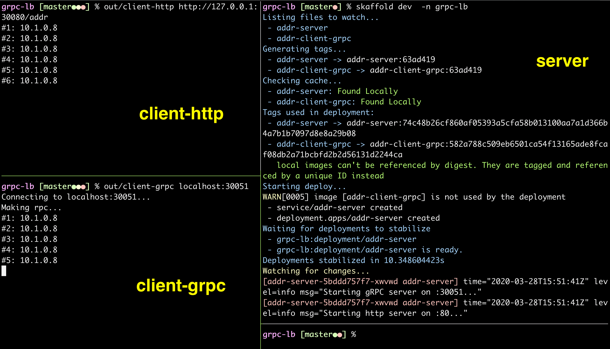
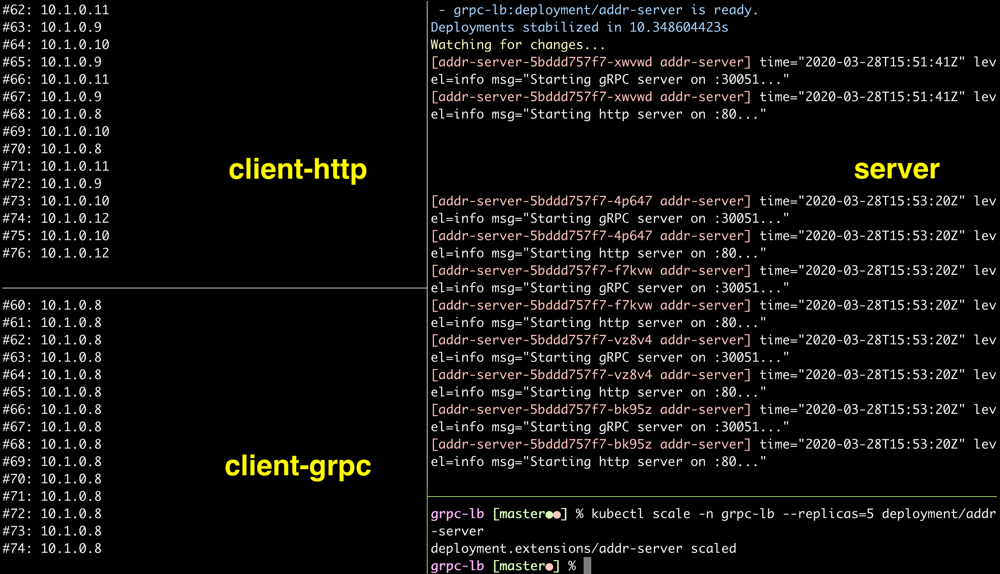

# gRPC Load Balancing Demo

A simple demo of gRPC load balancing.


## Environment requirements

The following software is required to run the demo: 

 - Go 1.14 or above.
 - Kubernetes
 - [Skaffold](https://skaffold.dev/) 1.6.0 or above.
 - [Linkerd](https://linkerd.io/) 2.0 or above.


## Demo in native mode

### Build

Build the native binaries:

```bash
./build.sh
```

The following binaries will be generated in the `out` directory:

```
client-grpc
client-http
server
```

### Run

Arrange your terminal as follows:


**Pane A**
Start the server:

```bash
out/server
```

The server provides the same addr service via 2 TCP ports:

- Port 80 for http
- Port 30051 for gRPC

**Pane B**
Connect to server's addr service via http endpoint:

```bash
out/client-http  http://127.0.0.1:80/addr
```

You can see the IP address of the connected server instance.

**Pane C**
Connect to server's addr service via gRPC endpoint:

```bash
out/client-grpc  localhost:30051
```

You can see the IP address of the connected server instance.


## Demo in Kubernetes

### Preparation

Create `grpc-lb` namespace for this demo:

```bash
kubectl create ns grpc-lb
```

Build images:

```bash
skaffold build
```

### Run without gRPC load balancing

Run server in `grpc-lb` namespace:

```bash
skaffold dev  -n grpc-lb
```

The server provides the same addr service via 2 TCP ports:

- Port 30080 for http
- Port 30051 for gRPC

Run native client-http:

```bash
out/client-http  http://127.0.0.1:30080/addr
```

Run native client-grpc:

```bash
out/client-grpc  localhost:30051
```




Scale the server to 5 pods:

```bash
kubectl scale -n grpc-lb --replicas=5 deployment/addr-server
```

You can see that only one gRPC server pod (10.1.0.8) is being connected to and serving the same client-grpc instance.




## Demo in Kubernetes + service mesh

### Enable Linkerd

Install Linkerd 2 into active Kubernetes cluster:

```bash
# Install
linkerd install | kubectl apply -f -

# Check
linkerd check
```

Delete the old namespace `grpc-lb`:

```bash
kubectl delete ns grpc-lb
```

Create a new namespace `grpc-lb` with Linkerd injected:

```bash
kubectl apply -f ns.yml
```


### Run with gRPC load balancing

Uncomment the following line in `skaffold.yaml`:

```yaml
      - client-grpc.yml
```

Run server and k8s version of client-grpc in `grpc-lb` namespace:

```bash
skaffold dev  -n grpc-lb
```

Run native client-grpc, as a comparison:

```bash
out/client-grpc  localhost:30051
```

Make sure you have run these commands as follows:


Wait for the whole clients and server becoming stable.

Now, scale the server to 5 pods:

```bash
kubectl scale -n grpc-lb --replicas=5 deployment/addr-server
```

You can see that all gRPC server pods (10.1.0.71 -- 10.1.0.75) take turns in serving the same client instance within the same `grpc-lb` namespace.


View Linkerd dashboard:

```bash
linkerd dashboard &
```

You can see the topology of native client-grpc, meshed client-grpc and meshed server:


You can also see that all gRPC server pods take turns in serving the same client instance within the same `grpc-lb` namespace.

